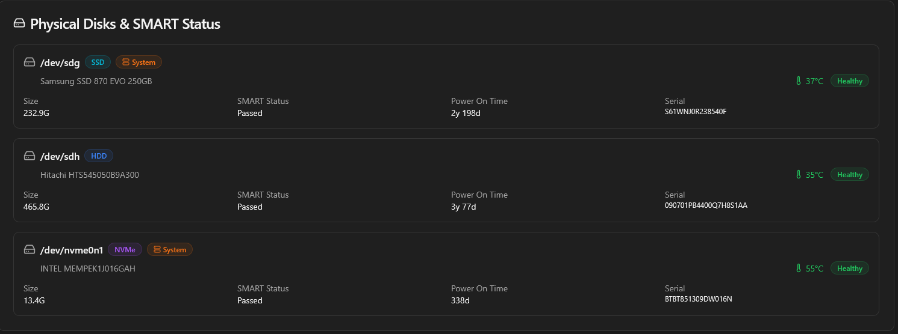

## Introducción

Tal y como prometí, voy a hacer un tour por mi actual HomeLab, en el momento de escribir este post, sigo con Proxmox, por lo que toda la infraestructura está sobre Proxmox, la migración es un proceso lento que no puedo hacer de la noche a la mañana, requiere de una planificación y, por supuesto de unas copias de seguridad. En todo caso, este es mi HomeLab.

## Hardware

Aunque hablé un poco del hardware en el [post anterior](), pero aquí voy a hacerlo de forma más extensa. 

Empezamos hablando de la base de todo equipo informático, la placa base o *motherboard*, es una [Machinist H81M-PRO-S1](https://theretroweb.com/motherboards/s/machinist-h81m-pro-s1), placa base que, como comenté en el [anterior post](), las placas base de la época eran algo caras para ser de segunda mano y esta tiene cosas, que en su época no tenían, como una ranura NVMe (aunque en la web que he enlazado, dice que es M.2 SATA, en mi caso no funcionó, solo funciona con NVMe, y no he visto en la BIOS opción para configurarlo como M.2 SATA), que si bien no va a ser como las de equipos modernos, está bien para quien tenga un equipo de la época y quiera usar un almacenamiento de estos, además de que con adaptadores se puede expandir como un PCIe normal.

El cerebro, Intel Core i5-4590, un procesador, que para el propósito, rinde estupendamente, y no flaquea en nada. Rinde bien tanto como un ordenador de escritorio como servidor. Muy bien Intel.

RAM, 16GB de RAM DDR3 en 2 módulos de 8GB cada uno de la marca Kingston HyperX.

GPU, Intel Arc A310, este elemento fue pensado para las transcodificaciones de Jellyfin, que a día de hoy no solo para Jellyfin, también se usa en Nextcloud e Immich. Esto creo que es lo mejor de mi HomeLab, es una GPU que rinde tan bien, que me han dado ganas de adquirir otra para usarla única y exclusivamente en mi PC para realizar grabaciones con ella, para los clips de los juegos y manejar el escritorio con ella y quitarle carga a la GPU principal. Si alguien está pensando en montar una GPU dedicada para un HomeLab o para tareas de grabación y transcodificación y no quieres gastar en una GPU de Nvidia, la Intel Arc A310, es una opción muy a tener en cuenta, de verdad, la recomiendo.

Como controladora de almacenamiento estoy utilizando actualmente una LSI 2008, de la marca Dell (no recuerdo el modelo exacto), en un inicio la compré para tener un hardware dedicado de RAID en mi PC, pero después de decidir centralizar todo el almacenamiento en Orochi, decidí pasarla a este, pasándola de modo *IR (Integrated RAID)* a *modo IT (Initiator Targered)*, para que funcione como una controladora de almacenamiento normal, sin funciones de RAID. 
Pasar de una controladora SATA PCIe que el chip no era lo mejor, a esta controladora, la estabilidad del servidor se ha notado bastante, antes no podía hacer un balanceo BTRFS porque se congelaba Proxmox completamente.


_Controladora LSI que tengo instalada_

Almacenamiento. Este apartado lo voy a separar en dos apartados, almacenamiento del sistema y almacenamiento de datos. 
El almacenamiento del sistema tengo 3 discos, un SSD Samsung 870 EVO de 250GB donde está instalado Proxmox, un HDD Toshiba de 1TB (reciclado de una PS4) donde almaceno principalmente las copias que hago con Proxmox Backup Service (del que hablaremos un poco más adelante), almacenar ISOs, plantillas y algunas copias varias, así me ahorro espacio en el SSD que, como veréis, está un poco al límite ya. Y como ultimo un Intel Optane de 16GB. Este fue comprado en un principio para instalar en el TrueNAS, ya que este al ser un sistema inmutable y que ocupa tan poco, en un SSD de 16GB era perfecto, y así poder usar un SSD para las apps de Docker. Actualmente, lo ando usando como Swap de Proxmox, que es mas o menos para lo que se diseñaron estas unidades, una caché entre almacenamiento lento y procesador. Hablamos de cuando los SSD eran caros (más o menos como los precios que tienen actualmente con la crisis de la IA). 


_SSD Samsung, HDD Toshiba y Optane_

En almacenamiento de datos tengo una configuración, que si bien soy consciente de que no es la mejor, es la que actualmente puedo permitirme. Actualmente la configuración de discos es de 6 unidades HDD, 4 de 2TB Seagate Barracuda y 2 de 500GB uno Western Digital Blue y Seagate Barracuda. Como veis, todos son de escritorio, repito, es la configuración que me he podido permitir, se que para esto los discos de NAS son los más adecuados, pero es lo que la economía de un estudiante puede dar.


_Configuración de almacenamiento actual_
### Subsección

Detalles adicionales aquí.

## Sección 2

Más contenido organizado en secciones claras.

## Conclusión

Resumen o reflexión final sobre el tema.

---

## Notas útiles para escribir posts

### Formato de la fecha
- Usa formato `YYYY-MM-DD HH:MM:SS +0000`
- Ejemplo: `2026-05-07 14:30:00 +0200`

### Categorías
- Máximo 2 niveles recomendado
- La primera es la principal, la segunda es una subcategoría

### Etiquetas
- Usa etiquetas cortas y descriptivas
- Sepáralas por comas

### Imagen destacada
- `path`: ruta relativa a la imagen
- `lqip`: (opcional) versión borrosa para carga progresiva
- `alt`: siempre incluye texto alternativo para accesibilidad

### Sintaxis Markdown
- `# Título 1`, `## Título 2`, `### Título 3`, etc.
- `**negrita**`, `*cursiva*`, `` `código inline` ``
- ` ``` código ``` ` para bloques de código
- `> cita` para citas
- `- lista` para listas sin orden
- `1. lista` para listas numeradas
- `[enlace](url)` para enlaces

### Front matter opcional
```yaml
author: Nombre del autor # Si tienes múltiples autores
pin: true # Para fijar el post en la portada
math: true # Si usas ecuaciones matemáticas
mermaid: true # Si usas diagramas Mermaid
comments: true # Para habilitar comentarios (por defecto activado)
```

### Ejemplo con más opciones
```yaml
---
title: Mi Primer Post
date: 2026-05-07 10:00:00 +0200
categories: [Desarrollo, Web]
tags: [jekyll, blog, tutorial]
description: Aprende a crear tu primer post en Jekyll con Chirpy.
image:
  path: /assets/img/posts/2026-05-07-primer-post.jpg
  alt: Captura de pantalla del post
author: Tu Nombre
pin: false
math: false
mermaid: false
---
```

## Instrucciones para usar esta plantilla

1. Copia este archivo
2. Renómbralo como `YYYY-MM-DD-tu-titulo.md` (ej: `2026-05-07-mi-primer-post.md`)
3. Reemplaza el contenido del front matter y el cuerpo
4. Guarda en la carpeta `_posts/`
5. Haz push al repositorio
6. El sitio se compilará automáticamente