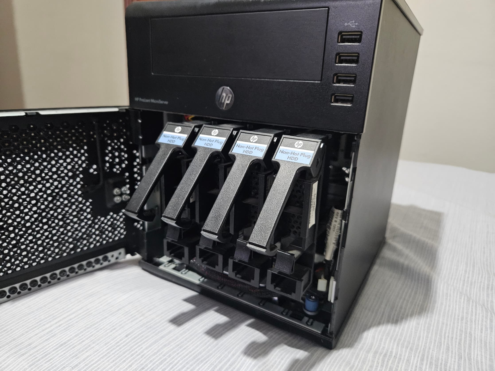
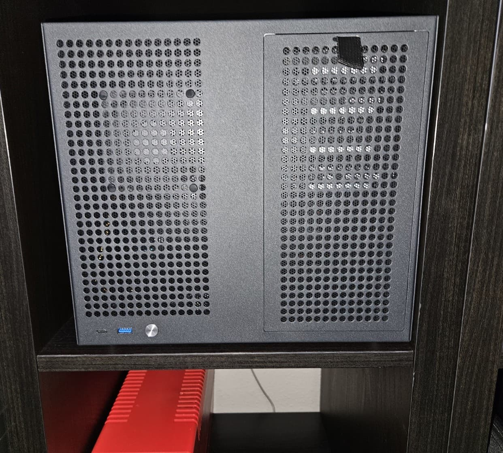

## Introducción

Llevo un año completo usando Proxmox como mi sistema para mi HomeLab, y he sentido que se me quedaba grande para el hardware que tengo actualmente, bueno, más que el hardware, la infraestructura.

Para llegar al punto en el que estoy actualmente tengo que hacer un pequeño recorrido por mi viaje, empezando por mi primer servidor. HP Proliant Gen 7 N40L.

## HP Proliant N40L, el inicio de todo

Empecé como ya he mencionado con el HP Proliant N40L, máquina que a día de hoy sigo teniendo, pero arrinconada y sin uso. Empecé usándola como NAS, que fue el propósito de comprarla, montar mi primer NAS. Aunque mas que montar el NAS, quería comprar un NAS, pero cuando vi los precios de estos, me lo plantee. Y donde yo trabajaba en aquella época, que era una tienda de informática de barrio, montamos varios NAS para algunos clientes con el DSM de Synology.

Iba decidido a adquirir un Synology, pero los precios eran algo elevados y al descubrir que se podía instalar DSM en cualquier hardware, fui buscando un equipo para montarlo, ahí fue cuando me topé con el Proliant N40L, iba buscando realmente el Gen 8, que era el que teníamos allí en el taller, pero por el precio que creo recordar que fueron unos 90€ con 4GB de RAM ECC, no me lo pensé y lo compré, además venía con 3 discos de 500GB y yo tenía uno de 500GB que usé para completar las 4 bahías.

_Mi HP Proliant_

Fue gratificante el haber montado el NAS con DSM, ya que el proceso no era muy sencillo, en ese momento no había loaders para DSM 7, si no que era el 6, para el 7 aún no había nada. Estuve con el bastante tiempo, hasta que se me olvidó la clave de administrador y tuve que re-hacer todo el NAS, sacar los datos, borrar los discos y volver a empezar el proceso, pero esta vez lo hice con DSM 7 y el loader  *[TinyCore RedPill Loader](https://xpenology.com/forum/topic/53817-tinycore-redpill-loader-tcrp/)* (TCRP), que lo hizo sencillo. Y estuve otro tiempo largo con el, hasta que empecé a valorar temas de seguridad, ya que con estos loaders no se puede actualizar el sistema o se queda muerto el loader, y ahí fue cuando empecé a buscar alternativas a este.

Estuve probando en entorno virtual varias soluciones, [OpenMediaVault](https://www.openmediavault.org/) y [TrueNAS](https://www.truenas.com/) fueron las principales, al final me quedé con OpenMediaVault (OMV), ya que en aquella época, TrueNAS, la versión Core, que estaba basada en FreeBSD, era corta para lo que iba buscando, alternativas a las apps de Synology (Drive, Photos principalmente) y la versión Scale, era muy pesada para el hardware que tenía, principalmente para la escasa RAM que tenía, y OMV me ofreció un uso de recursos bastante asequible, además de tener la posibilidad de usar Docker.

### Mis inicios con OpenMediaVault

Cuando instalé OMV en el Proliant, noté como se aprovechaba el hardware al máximo, Docker me daba esa libertad de desplegar aplicaciones, además de haber descubierto un ecosistema de aplicaciones *selfhosted* bastante amplia y muy rica, ahí fue cuando descubrí Nextcloud, Immich, Jellyfin, aplicaciones que sigo usando día a día. También aprendí a usar un reverse proxy, como *Nginx Proxy Manager* y también descubrí DuckDNS como dominio, en sustitución del que usaba que era NoIP, que se me hacía un rollo el tener que estar cada mes confirmando que quería renovar (de forma gratuita) mi dominio. Aprendí mucho de administración de sistemas y Docker, de hecho Docker fue un vicio absoluto, desplegar soluciones con tan solo unas líneas y tenerlas aisladas sin romper el sistema host fue lo mejor que pude descubrir.

En este punto, ya había actualizado la memoria RAM, primeramente con módulos RAM de escritorio, sin ECC ya que no era capaz de encontrar un módulo que funcionase, hasta que al final acabé encontrándolo. La configuración de RAM que tiene actualmente es de 8GB de RAM ECC DDR3.

## La transición al nuevo hardware

Empecé a sentir al Proliant algo corto en recursos, Jellyfin se colgaba cuando quería reproducir contenido desde fuera de mi red local o se querían reproducir varias sesiones, plantee el ponerle una GPU para las transcodificaciones, pero las más compatibles con este Proliant eran muy antiguas y caras en el mercado de segunda mano o Aliexpress. Por lo que decidí usar una Intel ARC A310, además de querer usar Proxmox, cosa que era imposible, ya que este Proliant, no admite IOMMU, no queda muy claro si es que viene limitado por la BIOS el soporte o el chipset no tiene esa función, lo que fuese, mi idea de virtualizar un NAS no era posible. Por lo que haciendo limpieza, encontré este i5-4590, tenía memoria RAM, pero me faltaba una placa base. Tras valorar el montaje un nuevo homelab, me aventuré a comprar en Aliexpress una placa base H81, concretamente una [Machinist H81M-PRO-S1](https://theretroweb.com/motherboards/s/machinist-h81m-pro-s1). Las placas base de la época de un fabricante como ASUS, MSI o Intel, en el mercado de segunda mano eran caras, y esta, nueva, era muy económica. Por lo que decidí montar el servidor.

_Orochi actualmente_

En este hardware empecé a usar Proxmox, configuré una máquina virtual para usarla como NAS, empecé con TrueNAS, ya que estuve usándolo en el Proliant antes de montar este hardware y no quería perder los datos. En ese momento solamente tenía 4 discos, 2 de 2TB y 2 de 500GB (todos de escritorio) por lo que usaba una controladora SATA PCIe de 6 puertos, que más tarde cambié por una controladora LSI 2008 para poder tener las 8 bahías de la caja disponibles. En un inicio estaba montado en una torre ATX estándar, decidí cambiar el hardware a una caja de NAS para tenerlo en una estantería más recogido y fuera de peligro. La caja tiene 8 bahías para discos, de ahí el nombre que le puse, Orochi, por la serpiente de 8 cabezas de 8 cabezas de la mitología japonesa, *Yamata no Orochi*

Y desde entonces llevo usando Proxmox, OMV como NAS para ahorrar recursos y dedicarlos a otras aplicaciones, y muchos LXCs que os mostraré en otro post donde os haga un recorrido por mi Proxmox.

## El punto de inflexión, ¿Proxmox es demasiado para mi infraestructura actual?

Esta es la pregunta a la que, después de haberte dado la chapa con mi viaje por el mundo del homelab, esperabas que respondiese, ¿es demasiado para la infraestructura que tengo? La respuesta es corta, si. No estoy aprovechando características clave que tiene Proxmox como *high availability*, o la migración en vivo porque no tengo hardware redundante para aprovecharlas. Además de estar teniendo ciertos problemas con el NAS y esa capa de virtualización, siento que estoy perdiendo rendimiento, de la LSI y de todo el hardware en general. Con la infraestructura que tengo actualmente, con usar OMV o TrueNAS sería mas que suficiente, se aprovecha mejor el hardware, no tengo la latencia, a pesar de tener *passthrough* en la LSI, siento esa latencia, por no hablar de como está estructurado actualmente, que para compartir carpetas para Nextcloud, Immich y Jellyfin, por mencionar algunas, pierdo velocidad y tengo cuello de botella. Por lo que, abandono Proxmox y voy a dedicar el hardware a lo que inicialmente estuvo pensado, ser un NAS.

Haré un post dedicado al proceso de migración de Proxmox a OMV, por lo que recomiendo estar al tanto.

Si has llegado hasta el final, darte las gracias por tomarte el tiempo en la lectura de este post y también agradecerte por haber descubierto mi blog, y si te gusta, compártelo. Este es mi primer post, se agradecen comentarios para mejorar.