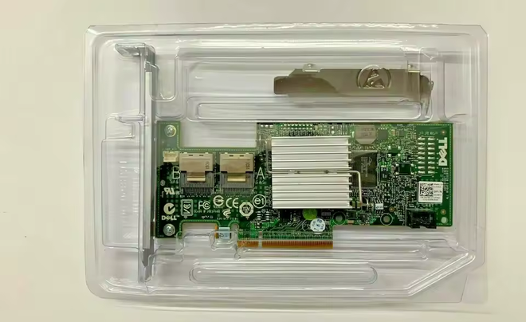
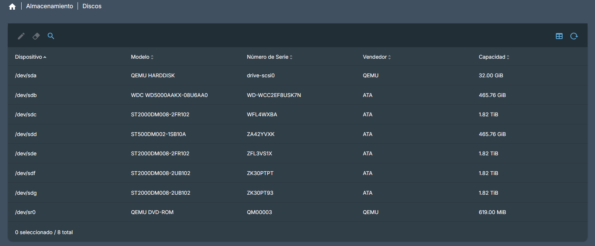
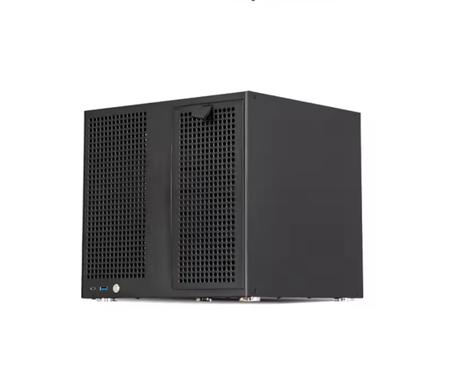
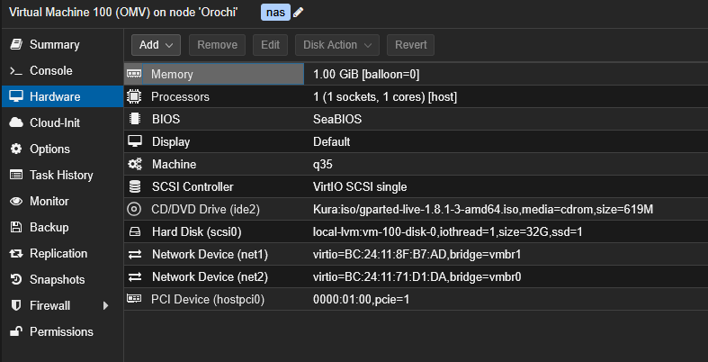
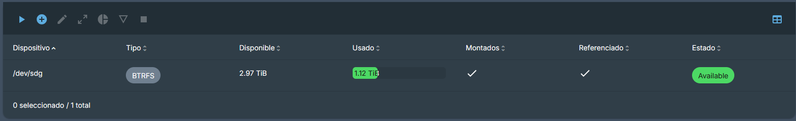
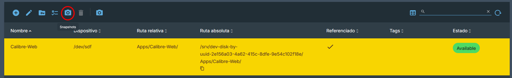
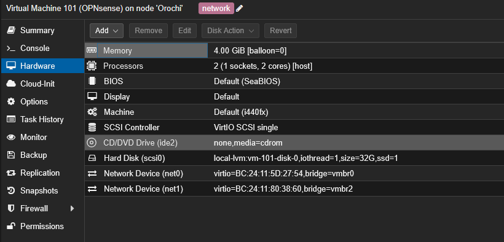
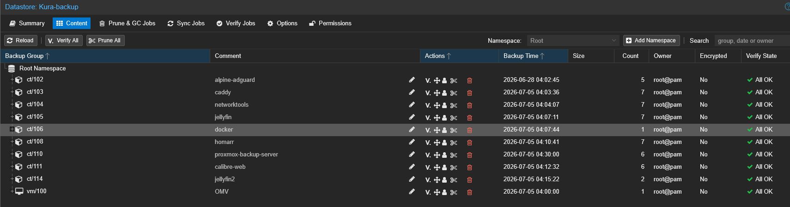

## Introducción

Tal y como prometí, voy a hacer un tour por mi actual HomeLab, en el momento de escribir este post, sigo con Proxmox, por lo que toda la infraestructura está sobre Proxmox, la migración es un proceso lento que no puedo hacer de la noche a la mañana, requiere de una planificación y, por supuesto de unas copias de seguridad. En todo caso, este es mi HomeLab.

## Hardware

Aunque hablé un poco del hardware en el [post anterior](), pero aquí voy a hacerlo de forma más extensa.

### Placa base

Empezamos hablando de la base de todo equipo informático, la placa base o *motherboard*, es una [Machinist H81M-PRO-S1](https://theretroweb.com/motherboards/s/machinist-h81m-pro-s1), placa base que, como comenté en el [anterior post](), las placas base de la época eran algo caras para ser de segunda mano y esta tiene cosas, que en su época no tenían, como una ranura NVMe (aunque en la web que he enlazado, dice que es M.2 SATA, en mi caso no funcionó, solo funciona con NVMe, y no he visto en la BIOS opción para configurarlo como M.2 SATA), que si bien no va a ser como las de equipos modernos, está bien para quien tenga un equipo de la época y quiera usar un almacenamiento de estos, además de que con adaptadores se puede expandir como un PCIe normal.

### CPU y RAM

El cerebro, Intel Core i5-4590, un procesador, que para el propósito, rinde estupendamente, y no flaquea en nada. Rinde bien tanto como un ordenador de escritorio como servidor. Muy bien Intel.

RAM, 16GB de RAM DDR3 en 2 módulos de 8GB cada uno de la marca Kingston HyperX.

### GPU, la joya de la corona

GPU, Intel Arc A310, este elemento fue pensado para las transcodificaciones de Jellyfin, que a día de hoy no solo para Jellyfin, también se usa en Nextcloud e Immich. Esto creo que es lo mejor de mi HomeLab, es una GPU que rinde tan bien, que me han dado ganas de adquirir otra para usarla única y exclusivamente en mi PC para realizar grabaciones con ella, para los clips de los juegos y manejar el escritorio con ella y quitarle carga a la GPU principal. Si alguien está pensando en montar una GPU dedicada para un HomeLab o para tareas de grabación y transcodificación y no quieres gastar en una GPU de Nvidia, la Intel Arc A310, es una opción muy a tener en cuenta, de verdad, la recomiendo.

### Controladora de almacenamiento

Actualmente estoy utilizando una LSI 2008, de la marca Dell (no recuerdo el modelo exacto), en un inicio la compré para tener un hardware dedicado de RAID en mi PC, pero después de decidir centralizar todo el almacenamiento en Orochi, decidí pasarla a este, pasándola de modo *IR (Integrated RAID)* a *modo IT (Initiator Targered)*, para que funcione como una controladora de almacenamiento normal, sin funciones de RAID.
Pasar de una controladora SATA PCIe que el chip no era lo mejor, a esta controladora, la estabilidad del servidor se ha notado bastante, antes no podía hacer un balanceo BTRFS porque se congelaba Proxmox completamente.

_Controladora LSI que tengo instalada_

### Almacenamiento

Este apartado lo voy a separar en dos apartados, almacenamiento del sistema y almacenamiento de datos.

#### Almacenamiento del sistema.

Tengo 3 discos, un SSD Samsung 870 EVO de 250GB donde está instalado Proxmox, un HDD Hitachi de 500GB donde almaceno principalmente las copias que hago con Proxmox Backup Server (del que hablaremos un poco más adelante), almacenar ISOs, plantillas y algunas copias varias, así me ahorro espacio en el SSD que, como veréis, está un poco al límite ya. Y como ultimo un Intel Optane de 16GB. Este fue comprado en un principio para instalar en el TrueNAS, ya que este al ser un sistema inmutable y que ocupa tan poco, en un SSD de 16GB era perfecto, y así poder usar un SSD para las apps de Docker. Actualmente, lo ando usando como Swap de Proxmox, que es mas o menos para lo que se diseñaron estas unidades, una caché entre almacenamiento lento y procesador. Hablamos de cuando los SSD eran caros (más o menos como los precios que tienen actualmente con la crisis de la IA). 

_SSD Samsung, HDD Hitachi y Optane_

#### Almacenamiento de datos

Tengo una configuración, que si bien soy consciente de que no es la mejor, es la que actualmente puedo permitirme. Actualmente la configuración de discos es de 6 unidades HDD, 4 de 2TB Seagate Barracuda y 2 de 500GB uno Western Digital Blue y Seagate Barracuda. Como veis, todos son de escritorio, repito, es la configuración que me he podido permitir, se que para esto los discos de NAS son los más adecuados, pero es lo que la economía de un estudiante puede dar.

_Configuración de almacenamiento actual_

### Chasis

En un inicio lo monté en una torre ATX de Asus (no recuerdo modelo exacto) y como estaba demasiado a mano, recibía muchos golpes y en general, no estaba seguro, decidí cambiarlo a un chasis de NAS, mas compacto y puedo ponerlo en una estantería y pasa desapercibido. Tenía principalmente un chasis de la marca Jonsbo, concretamente el N6, ya que tenía completa compatibilidad con fuentes SFX y ATX, y para no cambiar la fuente de alimentación ATX, era la ideal, aunque se salía de presupuesto, tanto en Aliexpress como Amazon. Por lo que en búsqueda de un chasis de similares características, encontré el que acabé adquiriendo, Sagittarius de 8 bahías, bastante más económico y cumplía con lo que buscaba, no cambiar la fuente de alimentación.

_Sagittarius de 8 bahías_

## Proxmox, el centro neurálgico

Habiendo hablado del hardware, toca hablar del software, de sistema operativo uso Proxmox en su ultima versión, la 9.2.3, configurado de la siguiente manera, instalación sobre el SSD Samsung 870 EVO, swap sobre el Intel Optane de 16GB y el HDD como he mencionado, para un almacenamiento no tan rápido.

La post instalación la realicé con [ProxMenuX](https://proxmenux.com/en/), post instalación que deja Proxmox bastante usable y con apenas esfuerzo, luego, para tener el ultimo *microcode* del CPU o para asegurarme que está instalado, utilicé el script de *[PVE Processor Microcode](https://community-scripts.org/scripts/microcode)* de [Helper Scripts](https://community-scripts.org/) (conocido ahora como Community Scripts)

Cuento con 2 redes virtuales, la primera de las redes pensada para que sea utilizada con OPNSense y la segunda, pensada para compartir recursos NFS de forma aislada y rápida sin depender de la red hacia el hypervisor, para, como mostraré más adelante, utilizar *mount points* para los distintos LXCs.

### Máquinas Virtuales

Aquí empieza el tour, aquí empieza lo bueno. Tengo 2 máquinas virtuales (de aquí en adelante me referiré a ellas como VM para abreviar), la primera VM, con el ID 100, se trata de OMV (OpenMediaVault), mi NAS. Y la segunda VM con el ID 101, OPNSense.

#### OMV

Como he mencionado, OMV es mi sistema de NAS, ¿por que OMV y no TrueNAS o UnRaid? Por su eficiencia en recursos y coste. OMV es gratuito, open source y consume muy pocos recursos, y para tener un NAS en un entorno virtualizado, cuando se va justo de memoria RAM es ideal, además de ser muy flexible. La configuración de hardware virtual que tiene asignado OMV es 1GB de RAM y 1 núcleo de CPU. La versión que tengo instalada es la última en este momento, 8.4.0 basado en Debian 13 (Aunque está la versión 8.5, yo al momento de escribir esto no lo había actualizado aún).

_Asignación de recursos de OMV_

Con esta cantidad de recursos se mueve bastante bien, no he tenido ningún problema de rendimiento, caída a la hora de transferir datos ni en el uso de las carpetas compartidas NFS. Tengo sobre este instalada la app de sincronización Syncthing para sincronizar algunas carpetas entre ordenadores y que sea el NAS el que actúe como un punto intermedio entre estos equipos.

##### Almacenamiento

Que sería de un NAS si no hablo de como tengo configurado el Aray de discos. Tengo un RAID 1 sobre BTRFS, con los discos que mencioné 4 HDD de 2TB y 2 HDD de 500GB, teniendo una suma total de unos 4,1TB, espacio más que suficiente para almacenar fotos, documentos y archivos. Aunque siendo honesto, para un administrador de sistemas, que guarda herramientas informáticas y programas que son difíciles de encontrar, esta cantidad de espacio, es insuficiente, aunque me quedan disponibles unos 2,97TB, esta cantidad para un perfil como el mío es insuficiente.

_RAID 1 sobre BTRFS_

Si bien OMV no es capaz desde la WebUI gestionar de forma sencilla la agregación de volúmenes al RAID, se puede hacer desde consola, lo que da aun más flexibilidad si la WebUI se queda corta.

##### Configuraciones útiles

Gracias a la flexibilidad que da OMV, al basarse en un Debian, se pueden aprovechar todas sus características, por lo que una de las funciones que aprovecho es la creación de scripts y levantarlos vía servicio SystemD. Y si, has adivinado, tengo un script justo así. Se trata de un Script que se encarga vía SSH de conectarse al host de Proxmox, para realizar el montaje de compartidos NFS sobre este y a su vez, cuando los recursos NFS están listos, inicia los LXC que correspondan a los montajes NFS. Este script me salva de tener que montar de forma manual los NFS cada vez que reinicio Proxmox u OMV. Para que este script se ejecute, hay dos maneras de hacerlo, o bien por tarea cron o por servicio SystemD, y la opción de servicio de SystemD es la más eficiente, ya que podemos definir algún requisito para que se ejecute, como en este caso para NFS lo importante es tener red, dejamos que el servicio espere hasta que la red esté lista y ahí es cuando se activa. Lo dejaré en mi [GitHub](https://github.com/cl0v3r404/NFS-Mount-Script-Proxmox.git) el script y la creación del servicio SystemD por si a alguien le interesa.

###### Tareas programadas

La otra de las características que podemos aprovechar es las tareas cron, y OMV facilita la configuración de estas a través de su WebUI.

_Todas las tareas cron configuradas_

Los tags de las tareas son bastante descriptivos, pero os haré un breve resumen de cada uno. 

1. `omv-upgrade`: Comando interno de OMV para actualizar su base (WebUI, herramientas asociadas, plugins, etc), programado de forma semanal, así mantengo el sistema actualizado.
2. Scrub: Comando de BTRFS para mantenimiento y reparación de errores en segundo plano, OMV no lo programa y es recomendable al menos una vez al mes realizarlo, para así evitar que se rompa algún bit de forma silenciosa y mantener todos nuestros datos lo más íntegros y seguros posibles. 
3. Snapshots: Snapshots de BTRFS, esto se puede configurar en la WebUI en el apartado de *Almacenamiento > Carpetas compartidas*, seleccionando la carpeta compartida y buscando el icono de *Snapshot* (que por ahora es una camara)

4. `duperemove`: Esto es deduplicación, esta herramienta no viene instalada en OMV por defecto (o al menos no venía cuando hice la instalación) y se encarga de comparar archivos y los que sean idénticos bloque a bloque, borra bloques repetidos y crea como una especie de enlace, permitiendo ahorrar espacio.

###### Plugins

Creo que esto es otra de los mejores puntos que tiene OMV, su ecosistema de plugins. Nos permite expandir OMV según nuestras necesidades, tiene un montón de plugins, NUT, servidores FTP, panel de Docker compose, Docker, Kubernetes y un largo etcétera que es mejor que es mejor que reviséis en la [web oficial](https://wiki.omv-extras.org/).

Si se instala OMV desde el ISO oficial, viene solo con algunos plugins, para poder tener acceso a todos los plugins, incluido Docker, se tiene que ejecutar en la terminal este comando `wget -O - https://github.com/OpenMediaVault-Plugin-Developers/packages/raw/master/install| bash` y se tiene acceso a todos los plugins.

Yo tengo instalados 3 plugins (aunque en la WebUI se muestran 4, OMV extras se cuenta como un plugin).
1. `openmediavault-apttool`: Herramienta gráfica (similar a lo que puede llegar a ser Synaptic en escritorio) para buscar, instalar, eliminar y congelar paquetes. Muy completa si no quieres utilizar la terminal para instalar paquetes.

_Pantalla principal del plugin con sus principales funciones_

2. `openmediavault-kernel`: Herramienta para gestionar los kernels instalados, marcar si queremos arrancar desde uno en concreto, agregar herramientas de diagnóstico o eliminar kernels antiguos.

3. `openmediavault-md`: Plugin para crear RAIDs basados en MD, por defecto no viene (en versiones antiguas si venía) y si quieres hacer un RAID tienes que tener instalado este plugin si o si.

#### OPNSense

Cambiamos de gestión de almacenamiento a gestión de red. OPNSense lo tengo actuando como un cortafuegos y creando una subred para tener los LXC aislados de mi red principal, para evitar ataques a esta. Algunos LXC y VM no están bajo a esta red, debido a que tenía problemas de conectividad decidí dejarlos en la red principal. A esta VM le tengo asignado un poco más de recursos, 4GB de RAM y 2 cores para no sufrir problemas de rendimiento.

_Asignación de recursos a OPNSense_

En esta no me voy a detener mucho ni a enseñar como la tengo configurada ya que puede haber información sensible que es mejor no mostrar. Lo que si puedo mencionar es la configuración de las interfaces de red.

La interfaz que actúa como WAN en OPNSense es la red puente que da a mi red principal y la  interfaz LAN es una interfaz creada desde Proxmox sin asignar dirección IP, gateway ni nada, únicamente creada la interfaz y OPNSense se encarga de todo incluido del DHCP. Aun siendo una interfaz privada y a la que se van a conectar "equipos" con IP fija, es recomendable tener un servicio DHCP por si hay que realizar algunas pruebas con algún LXC o VM y no se necesita asignar dirección IP fija.

### LXC

Pasamos de VM a LXC, la decisión de usar estos es por practicidad y flexibilidad para asignar recursos y hardware, además de tener un ahorro de recursos al no ejecutar un OS completo. Voy a pasar un poco más rápido por estos.

#### Adguard Home

Adguard Home, el sustituto moderno a PiHole, bloqueador de anuncios, que además este permite cifrado mediante certificado para, si queremos acceder a nuestro bloqueador desde fuera de nuestra red LAN. Nos permite configurar listas de bloqueo de publicidad y rastreadores con un clic y sin salir de la interfaz, es muy simple de configurar, mantener y administrar.

#### Caddy

En un pasado usaba Nginx Proxy Manager como reverse proxy y gestor de certificados. Caddy además de ser muy ligero, es portable, ya que todo va en un archivo de configuración, por lo que si se rompe o quieres desplegarlo en otro equipo, tan solo con copiar y pegar tu *caddy file* lo tienes desplegado. Tiene una curva de aprendizaje un poco más elevada que Ngix Proxy Manager, ya que al ser todo por texto tienes que conocer la sintaxis.

#### Docker network tools

Este LXC, denominado por mi *network tools* no es más que un Docker dedicado a algunas herramientas de red, en un inicio estaba constituido por 4 *stacks* Nginx Proxy Manager, ddnsupdater, Uptime Kuma y Docker bot, en la actualidad, la única que no está es Nginx Proxy Manager, que fue sustituida, por Caddy. 
1. [`ddnsupdater`](https://github.com/qdm12/ddns-updater): Contenedor simple, actualizar la ip mi dominio de duckdns y desec, es muy ligero y permite actualizar múltiples dominios en un solo lugar.
2. [`uptimekuma`](https://github.com/louislam/uptime-kuma): Monitor de estado de red, este lo uso para saber si algún servicio se cae, ya sea por que no tengo acceso a la red o por que el servicio ha dejado de funcionar.
3. [`docker-bot`](https://github.com/dgongut/docker-controller-bot): Bot de Telegram (aunque creo que se podía configurar para otros servicios de mensajería) que te deja interactuar con Docker sin tener que acceder a Portainer o tocar una línea de comandos. Avisa de actualizaciones de contenedores, avisa si un contenedor se detiene o se inicia. Tiene más funciones, pero para administrar las actualizaciones es un golazo.

#### Jellyfin

Sustituto perfecto a Plex. OpenSource, muy bien documentado y soporta transcodificación con una gran variedad de códecs, QSV, VAAPI, NVENC AMD AMF, por mencionar algunos.

_Lista de codecs soportados por Jellyfin_

También permite el uso de complementos, televisión en directo (con previa configuración) y DVR. Es muy completa, y complementada con la Intel Arc A310, es una pasada, con esta GPU, permite entre 5 y 6 transmisiones 4K en simultáneo. También si se combina con la suite *arr* (Sonarr, Bazarr, etc.) se convierte en un centro multimedia muy bueno.

Para poder acceder a las carpetas multimedia a través del NAS, hago uso del montaje NFS en el host mediante un *mount point* hacia el contenedor. Y sin olvidar el mapeo de la GPU para acceder a todas las funciones de transcodificación de la Intel Arc A310.

_Asignación de recursos a Jellyfin_

Una nota para hacer con respecto a esta asignación de recursos, el dispositivo */dev/dri/card0* no sería necesario tenerlo, ya que el importante es el */dev/dri/renderD129*. Card0 es para tener video, y Render es para renderizaciones *headless*.
#### Docker

Este LXC es un poco más genérico, no esta enfocado a ningún uso concreto, simplemente es un Docker para mis despliegues.
1. [Nextcloud](https://nextcloud.com/es/): La clásica del OpenSource, si quieres tener tu nube personal para dejar de depender de gigantes como Google, OneDrive, etc, es la ideal. Además de permitir expandirla mediante aplicaciones. Tiene una lista inmensa de aplicaciones tantas que te acabas perdiendo o instalando todas. Las que tengo instaladas que son más relevantes, Nextcloud Office, Cookbook para tener un recetario digital ordenado, Music para tener mi música como si fuese Navidrome o similar. En este caso el Nextcloud AIO oficial.
2. [`docker-bot`](https://github.com/dgongut/docker-controller-bot)
3. [Calibre Web](https://github.com/janeczku/calibre-web): Si tienes un e-book y tienes una biblioteca en calibre de escritorio y quieres transferir tus libros sin tener que conectarlo al PC, calibre web te deja acceder a toda tu biblioteca en cualquier lugar, sincronizar progreso de lectura y si tienes un e-book de la marca Kobo, sincronizar los libros directamente en la interfaz como si fuese la tienda oficial, y sincronizar el progreso de lectura.
4. [Homarr](https://homarr.dev/): Dashboard que uso tanto para acceder a algunas de las aplicaciones y monitorizar el sistema de un vistazo. Muy personalizable y se integra perfectamente con la suite *arr*.
5. [Immich](https://immich.app/): Sustituto a Google Fotos o iCloud, reconocimiento facial local, nada sale de tu control. Además puedes configurar una GPU para realizar conversiones en videos, imágenes y para que se apoye en el reconocimiento facial
6. [Paperless](https://docs.paperless-ngx.com/?__cf_chl_f_tk=E8bbraMF1lJnA5MZ0mhKWy6wByvNgdQMOxPPHNFN8VY-1783268851-1.0.1.1-09xwJZwH9xbUfSDRkN71B17R9bQr99mqvLOVF58j4oc): Esta es una de esas apps que no sabías que necesitabas hasta que la pruebas. Paperless se encarga de organizar tus documentos, aprende cómo clasificas los documentos para clasificarlos automáticamente, se puede conectar a tu mail para guardar y organizar los documentos cuando te llegan, y puedes buscar por contenido, ya que realiza previamente un OCR del documento. Muy recomendada si trabajas con muchos documentos y tienes un caos.
7. [qBittorrent](https://github.com/linuxserver/docker-qbittorrent): No hay mucho que explicar, el clásico gestor de torrent.
8. [Adguard sync](https://github.com/bakito/adguardhome-sync): esta utilidad es de esas que no se usan todos los días (o si) que sirve para mantener sincronizadas varias instancias de Adguard. Un ejemplo de ello sería si tienes un Adguard en un NAS y otra en un Home Assistant Green (o virtualizado en otro equipo), con modificar la configuración en una de las instancias, se replica a las que hayamos configurado, fácil mantenimiento y configuración.

Se que en la documentación de Proxmox se desaconseja del uso de Docker sobre un LXC, pero siendo realista, todo el mundo lo hace.

En este LXC, al igual que en el de Jellyfin tengo *mount points* hacia este para que los servicios que requieran de almacenamiento accedan a este.

_Asignación de recursos a LXC Docker_

#### PBS (Proxmox Backup Server)

Si, PBS se puede instalar en un LXC, pero ¿Por qué instalarlo en un LXC? Cuando no se tiene hardware para tener un PBS separado, que es lo más recomendado, se puede utilizar en un LXC. Este está configurado para que las copias que se realicen se guarden en el HDD de 500GB del sistema y luego, unas horas mas tarde, realice una sincronización hacia los discos del NAS, así mantengo la copia segura en caso de que el disco falle.

_Copias realizadas en PBS_

Los menos expertos en Proxmox se preguntarán ¿Qué diferencia hay entre realizar un backup normal desde la interfaz de Proxmox a usar PBS? La respuesta es muy diferenciadora, deduplicación. PBS utiliza la deduplicación, mientras que la interfaz de Proxmox utiliza una copia "normal", no elimina las redundancias, lo que puede llegar a ocurrir es que unas copias realizada con Proxmox ocupen varios Gigas teniendo exactamente el mismo contenido, mientras que con PBS, se copian los primeros Gigas y si el LXC o VM no cambia, hace deduplicación y si cambia, agrega solo los cambios, ahorrando bastante espacio. Además de que PBS se encarga de realizar un scrub y comprobación de integridad de los datos.

_Asignación de recursos PBS_

## Fin del tour

Y hemos llegado al final del tour, ha sido un tour bastante extenso, hemos tocado el hardware y el software, no he tocado el tema red, ya que la red hacia el servidor es bastante simple y no hay nada complejo. Me ha faltado un LXC, pero es una redundancia que tengo de Jellyfin para realizar algunas pruebas.

Este ha sido mi HomeLab al completo. Se que ha sido una lectura bastante extensa, darte las gracias por tomarte el tiempo en la lectura de este post, compártelo si te ha gustado y como frase de cierre decir, el HomeLab no es complejo, lo complicado es dejar de usarlo.