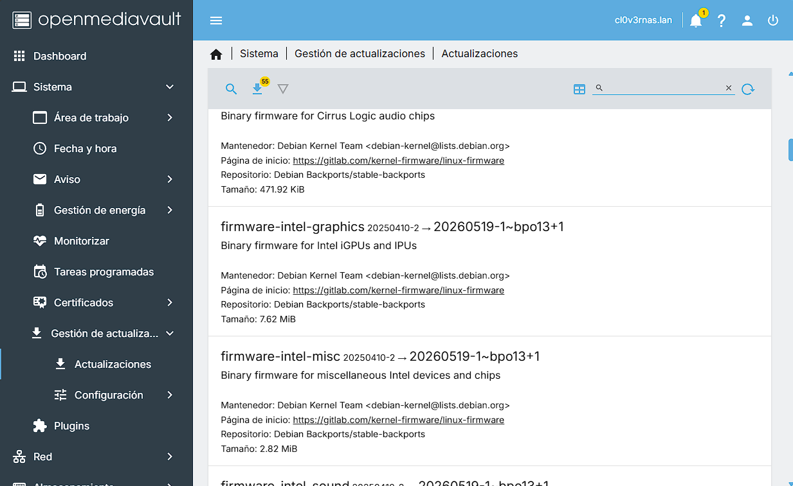

## Introducción

Como hablé en la [parte 1](), esta segunda parte se reanudará desde el proceso de instalación y pasaremos a hacer algunas configuraciones, que considero esenciales. Antes de comenzar, la parte de la instalación, las capturas serán realizadas desde una máquina virtual, ya que durante el proceso de instalación en *bare metal* hacer capturas de pantalla resultaba complicado, pero el proceso seguirá siendo el mismo. Sin más dilación comencemos

## Instalación de OMV

Para instalar OMV, utilicé la ISO oficial, si bien se puede utilizar una ISO de Debian vanilla, para ir más rápido utilicé la ISO oficial del proyecto. Para grabar la ISO en un USB, yo utilicé BalenaEtcher desde Windows, si bien se puede utilizar Ventoy, y de hecho tengo un USB con Ventoy, no tenía espacio para agregar la ISO y como tenía un USB de sobra, lo grabé con Balena.

### Instalador

Los que hayáis instalado Debian con el instalador no grafico os sonará la interfaz. Moverse con el teclado, nada de ratón.


_Selección de idioma_

La instalación es bastante desatendida, únicamente nos va a pedir intervención para asignar nombre al equipo, contraseña de root y si detecta más de una unidad de almacenamiento, donde queremos instalar el sistema, nada más.


_Selección del nombre del equipo. Esto se puede cambiar luego._


La instalación, en mi hardware, tardó unos 5 minutos aproximadamente. Obviamente, este tiempo variará dependiendo del hardware.


_Instalación finalizada_
## Primer arranque y configuraciones

Tras terminar la instalación, lo primero que siempre hago, es actualizar, así aseguramos tener todos los firmware instalados, parches de seguridad y versión de OMV a la última. Para ello actualizo desde la WebUI, ¿pero cual es la contraseña para acceder, la de root? No, la contraseña por defecto, cuando arrancamos OMV, aparte de darnos la IP que nos ha asignado DHCP, nos dice cual es el usuario y contraseña por defecto.


_Consola de OMV. Como se puede ver, nos da la IP actual, usuario y contraseña por defecto._

### Actualizaciones

Recién instalado el sistema, podemos llegar a tener más de 50 actualizaciones, entre kernel, paquetes del propio Debian, actualizaciones de seguridad y el propio OMV, sin olvidar los firmware. Instalamos todo y reiniciamos cuando termine el proceso.


_Actualizaciones de Firmwares, kernel y otros paquetes._

OMV, cuando realiza una tarea, como en este caso las actualizaciones, se abre una ventana que es, digamos un reflejo como de la consola de Linux, para que nosotros sepamos cuando ha terminado el proceso, nos suele mostrar al final del todo un *END OF LINE*.


Cuando termine las actualizaciones, aparecerá un cuadro amarillo de *cambios pendientes*, es importante aplicarlos antes de reiniciar, ya que muchos de los servicios durante el proceso de actualización habrán cambiado algunas configuraciones y OMV nos pide confirmación para ello. Cuando se confirmen los cambios, reiniciamos, y luego volvemos a comprobar actualizaciones. En instalaciones anteriores de OMV, volvían a aparecer actualizaciones, sobre todo de firmware, si no aparece ninguna actualización perfecto. 


_Cambios pendientes después de una actualización del sistema_

### OMV extras

Una de las configuraciones, que recomiendo instalar si o si es *OMV extras*, son una serie de plugins que no vienen por defecto con los repositorios post instalación (entiendo que por temas de licencias). Para esto recomiendo instalarlo vía SSH o desde la misma consola de OMV, si bien se puede instalar creando una tarea personalizada y ejecutándolo al momento, prefiero hacerlo por SSH. El comando para *OMV extras* lo encontramos en su [wiki](https://wiki.omv-extras.org/), aunque lo dejaré aquí también.

```sh
wget -O - https://github.com/OpenMediaVault-Plugin-Developers/packages/raw/master/install | bash
```

Cuando termine la instalación, actualizamos la interfaz con la combinación de teclas ``ctrl + shift + R``,  que es la combinación de teclas que recomienda el propio script al terminar. A simple vista parecería que no ha cambiado nada, pero si vamos al apartado de *Sistema*, veremos que ha aparecido el apartado de *omv-extras*, esta es la confirmación de que se ha instalado correctamente.

### Instalación de plugins

Vamos a instalar los plugins que recomiendo y que yo uso

- `openmediavault-apt`
- `openmediavault-apttool`
- `openmediavault-compose`
- `openmediavault-cputemp`
- `openmediavault-kernel`
- `openmediavault-nut`
- `openmediavault-timeshift`

En el apartado de plugins, los buscamos, lo único malo es que hay que ir instalando uno a uno los plugins, pero con paciencia se instalan.

### Configuración de almacenamiento

Antes de pasar a las configuraciones de Docker, hay que configurar los almacenamientos, hay dos maneras de configurarlos, si queremos hacer un RAID tradicional, tenemos que instalar el plugin de `openmediavault-md`, si queremos usar un RAID *BTRFS* (que es lo que recomiendo si queréis flexibilidad) en *Almacenamiento > Sistema de archivos > Crea y monta un sistema de archivos* podemos crear este RAID, ojo, si queremos usar *ext4* como sistema de archivos en el RAID, si o si tenemos que pasar por el plugin de MD.

Yo como ya tenía el RAID montado, solamente tuve que montarlo, así de sencillo. Luego ya montado, en *Almacenamiento > Carpetas Compartidas* creo las carpetas que me interesa tener, sobre todo las que usaré con Docker, que describo en el siguiente paso.
### Configuración de Docker

Como hemos instalado el plugin de compose, no vamos a hacer nada sin Docker, así que para instalarlo, en el apartado de *omv-extras*, vemos una casilla para habilitar el repositorio de Docker, la marcamos y guardamos.


_Repositorio de Docker habilitado_

Hay un post en el[ foro oficial](https://forum.openmediavault.org/index.php?thread/49357-omv-quick-configuration-guide/&l=2) de OMV, que es el que he seguido para configurar Docker bien, puede resultar un poco lioso al principio, sobre todo a la hora de establecer las carpetas para Docker, además dan algunos consejos como crear una serie de variables de entorno para los compose que nos ahorrarán mucho tiempo. Además de las variables que recomiendan en el foro, he creado las mías propias para las rutas de almacenamiento, así no tengo que escribir la ruta si quiero desplegar un compose nuevo.

También recomiendan crear un usuario y grupo para que se use con Docker y vincularlo a la variable de compose, es buena práctica ya que evitamos que siempre se ejecute como root.

```
PUID=1000 
PGID=1002
TZ=Europe/Madrid
PATH_DATA=/srv/dev-disk-by-uuid-2e156a03-4a62-415c-8dfe-9e54c102f18e/Apps #ruta donde guardaré los datos persistentes
PATH_CONFIG=/docker/appdata #ruta para las configuraciones
PATH_DB=/srv/dev-disk-by-uuid-5d06ab22-3c8f-4376-9f80-a937cb5bdc57/docker/db #ruta para guardar bases de datos
```

### Configuración de red

No, no me he olvidado de la configuración de red, esta es posiblemente la parte más importante, junto a los almacenamientos, de un servidor. La configuración que hice yo, fue crear una interfaz puente, por si en un futuro voy a usar virtualización con el plugin de KVM.

Para hacer una interfaz puente, en *Red > Interfaces*, borramos la interfaz que haya, tal cual, pero si aparece el cuadro amarillo, no confirmamos los cambios o perderemos la conexión a la red. Una vez borrada, creamos una interfaz y seleccionamos *puente*, dentro del menú, seleccionamos la interfaz que queremos usar, y asignarle una dirección IP estática (recomendado) y los servidores DNS, que recomiendo usar los de Cloudflare o Google (o combinados, como es mi caso), como al ser Linux, podemos usar varios servicios DNS para tener redundancia en caso de que uno caiga.


_Mi configuración de DNS es mixta, Cloudflare y Google mezclados_

Guardamos los cambios, y ahora si podemos aplicar los cambios del cuadro amarillo.


### Swapfile y Zram

Para ir terminando con la configuración básica, lo que haré sera cambiar la partición swap por un *swapfile* y configurar zram. Empecemos por el *swapfile*.

Lo primero es desactivar la swap y quitar la swap del fstab. No hace falta identificar el UUID de la swap, OMV, en su fstab, crea un comentario justo encima de donde se define la swap, por lo que no tiene perdida.

```sh
swapoff -a

nano /etc/fstab
#comentar la línea que contenga swap
```

Ahora toca crear el swapfile.

```sh
fallocate -l 4G /swapfile # el tamaño es el que queramos, podemos usar la mitad de la cantidad de RAM o la cantidad total de RAM
chmod 600 /swapfile
mkswap /swapfile
swapon /swapfile
```

Si con los comandos anteriores falla la creación de la swap usa este comando.

```sh
dd if=/dev/zero of=/swapfile bs=1M count=4096 # el final es el tamaño que asignamos al swafile anteriormente
```

Para comprobar si se ha creado correctamente ejecuta lo siguiente

```sh
swapon --show
```

Si se ha creado correctamente, verás algo similar a esto.

```sh
NAME       TYPE      SIZE   USED PRIO
/swapfile  file        8G     0B   10 
#size cambia según el tamaño que le hayas asignado al swapfile
```

Para que el sistema, si se reinicia, monte y utilice el swapfile, lo agregamos en el fstab.

```sh
/swapfile none swap sw,pri=10 0 0
```

Ahora instalamos y configuramos zram.

```sh
apt install zram-tools

nano /etc/default/zramswap
```

Dentro del archivo de zram, modificamos las siguientes líneas.

```sh 
ALGO=zstd #recomendado
PERCENT=50 #depende de la cantidad de RAM que tengas, si tienes menos de 4Gb, lo recomendable sería poner un 20%
PRIORITY=100 #importante, para que use zram antes que el swapfile.
```

Guardamos el fichero, reiniciamos el servicio y lo ponemos para que se ejecute al inicio del sistema.

```sh 
systemctl restart zramswap
systemctl enable zramswap
```

Si todo ha ido bien, veremos algo similar a esto.

```sh 
NAME       TYPE      SIZE   USED PRIO
/swapfile  file        8G     0B   10
/dev/zram0 partition 3.9G 964.8M  100
```

Si queremos asegurarnos de que el sistema utiliza zram antes que el swapfile, lo mas recomendable es ejecutar este comando.

```sh
echo 'vm.swappiness=100' >> /etc/sysctl.conf
```

## Cierre

Y con todo esto ya tenemos una instalación base de OMV, lista para crear contenedores de Docker, compartir archivos y usar nuestro NAS. La migración la pude hacer en cuestión de horas, lo que más tiempo me llevó fue el adaptar los Docker compose, restaurar los ficheros de configuración ya que tuve que hacer mucho movimiento de carpetas, con todo eso, al final se me alargó 2 días. En un siguiente post, publicaré los servicios que más se me resistieron a la hora de migrar, ya que algunos, como Adguard, quería que funcionase de una manera concreta junto con Unbound.

Quedad atentos al siguiente post, porque os mostraré la infraestructura de servicios que tengo actualmente desplegada y los cambios que he hecho aprovechando esta migración.

Dar las gracias a los lectores por haber llegado hasta aquí y espero que esto os haya servido de ayuda. Nos leemos en la próxima.