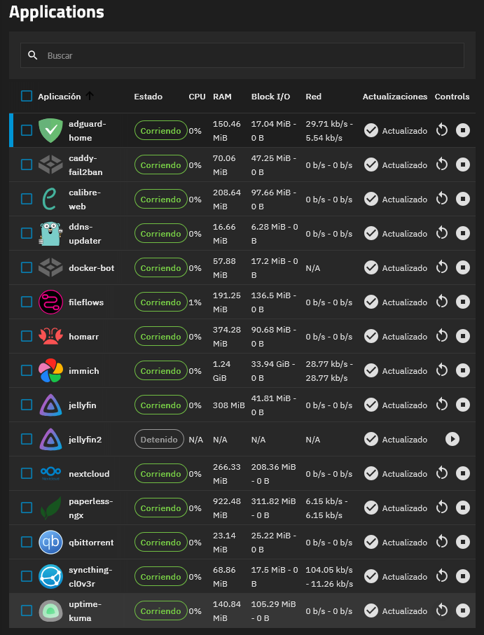

En el [post anterior](), prometí que os mostraría los servicios te tenía desplegados, en lo que preparaba ese post, me di cuenta de que OMV no se me terminaba de adaptar. No quiero que se me mal interprete, OMV es un sistema genial para montar un NAS casero, pero necesitaba algo más robusto, y más de mi experiencia anterior con OMV, de la que os voy a hablar porque considero importante comentarlo, tomé la decisión de migrar a TrueNAS. Barajé distintas opciones, Rockstor, un OpenSUSE Leap, pero TrueNAS fué la decisión tomada, los motivos, los describiré a continuación, sin olvidarme de la mala experiencia que tuve en OMV. 

## El incidente con OMV
No fue reciente en esta migración, si no en producción con Proxmox. Lo que sucedió fue que tenía las actualizaciones automáticas habilitadas para tener siempre mi sistema actualizado, un día al encender mi equipo para estudiar, me di cuenta de que mi Home, que tengo montada en el explorador de Windows, mostraba una capacidad bastante más pequeña de la que es. Me puse a investigar, entré en la consola y descubrí un montón de errores de BTFS, mi primer pensamiento, los HDD empezaron a fallar, pero antes de llegar a esa conclusión quise ver los Smart de los HDD, entré a la WebUI, y lo que vi fue una WebUI extremadamente lenta, hasta el punto en que en ocasiones no cargaba nada. Intenté en una consola, pero de tantos errores que recibía no podía ver si escribía los comandos bien, por lo que opté por un reinicio desde Proxmox, y durante el arranque veía que todo estaba en orden y cuando pasaba un rato volvían los errores de BTRFS. Volví a reiniciar, ya que no podía entrar siquiera a la CLI y por SSH también aparecían los errores, y en este reinicio me di cuenta de algo, el kernel que había instalado, era el 6.19, cuando es estable de Debian es el 6.12, arranqué con el kernel correspondiente, y tras comprobar que todo estuviese OK, me dispuse a eliminar el Kernel 6.19, que era el que dio problemas. 

Tras haber quitado el kernel y estabilizado mi sistema, consulté en la comunidad de reddit sobre si a alguien más le había ocurrido algo similar, y pareciera que se instaló desde los backports, no se si por accidente o porque los desarrolladores de OMV lo quisieron así. Igualmente, dejo enlazado la [publicación de reddit](https://www.reddit.com/r/OpenMediaVault/s/l2rKy8Xjct) para ampliar más información.

## ¿Por qué TrueNAS?
Esta será la pregunta que muchos se harán, ya que siempre he hablado bien de la eficiencia de recursos de BTFS. Los motivos por los que elegí TrueNAS son varios: gran estabilidad, robustez y una empresa detrás del desarrollo. Lo de la empresa a muchos quizá no es que les agrade, pero más allá de teorías conspiratorias de espionaje etc, etc, es porque al tener una empresa detrás aportando financieramente al proyecto, primero, asegura su continuidad y hace que se puedan corregir fallos y estabilizar el sistema más rápidamente. Además de tener la comodidad de instalar apps de docker con un clic y olvidarme sin tener que pelearme con docker compose, etc. 

## El proceso de migración
Como todo proceso de migración conlleva una planificación, y todo comienza por el respaldo de todos los datos. Esto es quizá lo más importante de todo, ya que vamos a cambiar de sistemas de archivos, BTRFS por ZFS. Esto quizá fue lo más tedioso, fueron 2 días de respaldo, no por la cantidad de datos, si no por un pequeño fallo por mi parte. Monté mi disco de destino de las copias que está en NTFS con ntfs-3g, el cual hace uso de FUSE para montarlo, y se hacían las copias extremadamente lentas, a pesar de estar el disco conectado a un puerto USB 3 y ser un disco USB 3. La solución, montarlo con ntfs3 el cual mejoró el rendimiento un montón. Las copias, con rsync, que además, parece que predije el pausar la copia, porque me vino de perlas para poder parar la copia y re-montar el disco con el driver correcto para que fuese mejor de rendimiento. Copié todo, los archivos de las apps de Docker, DB, mis datos (obviamente). 

El proceso de restauración pensaba que iba a ser más complejo, pero gracias a claude, pude montar el disco NTFS en TrueNAS. Por que digo esto, porque hace un tiempo, no era posible montar un disco que no fuese ZFS (o al menos no tuve éxito), ahora parece que ya si se puede montar para realizar este tipo de operaciones. Pero antes de restaurar hay que hacer el Pool, aquí cambie un detalle, el Pool está formado por 3 vdevs en un mirror, para tener más flexibilidad y poder mezclar discos, además, investigando, pude usar el Intel Optane para caché SLOG (o LOG), ya que usarlo para caché se iba a quedar corto. El SSD Samsung 870 EVO lo he usado para docker, y preguntarás "¿y el sistema, donde lo instalaste?", adquirí un SSD de 128GB de segunda mano por 15€, para el sistema está más que de sobra. Ahora si, con los pool creados, restauro los datos, que no tardó mucho en restaurarse, lo puse antes de acostarme, y para la mañana siguiente ya había terminado, luego tocó crear los datasets e ir organizando los datos, luego restaurar las apps con sus datos correspondientes. La única app que no pude restaurar fue Nextcloud, ya que en OMV, por alguna razón, se corrompió mi instalación, así que empecé una instancia nueva. 

## Pequeños inconvenientes
Como todo en la vida y en la informática, nada suele salir bien a la primera, y esto no iba a ser una excepción. Tenía mi Intel Arc A310 para transcodificaciones, pues con TrueNAS no puedo tener 2 GPUs activas a la vez o empieza a haber errores o directamente no funciona la transcodificación. Desactivar la iGPU hubiese sido una opción, pero al tener la Arc dentro con un raiser de minería y no tener las salidas de video por la parte trasera, dificultaba tener acceso a un monitor para entrar a la BIOS o ver que ocurre, así que por ahora, la Arc ya no está aquí, en su lugar, estoy usando la iGPU para las tareas de transcodificación, si bien, no puedo llegar a la calidad que con la Arc, me hace el apaño, además de convertir los archivos de video en formatos y codecs que reconozca la iGPU, para ello lo he automatizado con FilesFlow.   

## Mi stack actual
Para no extenderme mucho en este apartado, mencionaré que mi stack de apps no ha cambiado, sigo manteniendo las mismas que en OMV y Proxmox. Si algo funciona, ¿por que cambiarlo?

Algunas de las apps que se pueden ver, las que no tienen un icono han sido desplegadas mediante un *yaml*, y aquí es donde reside esa flexibilidad de Docker sobre Kubernetes. Para quien no sepa, en un pasado, TrueNAS utilizaba Kubernetes, y el paso hacia Docker ha hecho que su consumo de recursos sea menor y mucho más flexible y accesible.
## TrueNAS, la roca que necesitaba
He tardado un poco más en hacer este post, entre asuntos personales y probar la estabilidad. TrueNAS es lo que necesitaba, tener un NAS que funcione sin preocuparme de nada, desde el minuto 1, todo ha funcionado, exceptuando la Arc, que, espero que en un futuro solucionen esto y se puedan tener varias GPUs activas a la vez, pero por todo lo demás, funcionando perfecto, no he tenido que hacer configuraciones extras, modificar archivos, nada. Todo se configura desde la WebUI fácilmente y sin complicaciones. Si algo falla en la ultima update, retrocedo a la anterior con un clic, así de sencillo. 

Voy a hacer recomendaciones, si buscas tener un NAS que sea prácticamente instalar y usar desde el minuto 1, sin tener que hacer configuraciones complejas, TrueNAS es perfecto, y diría que se puede llegar a acercar a lo que se busca en un NAS comercial, usarlo desde el minuto 1. Si te gusta trastear, modificar y no te importa estar pendiente del sistema de vez en cuando OMV es una buena opción. 